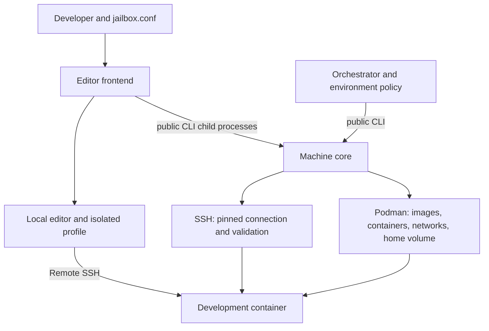

# Understanding jailbox

This guide explains how jailbox turns a development image into a sandbox, why
it sometimes refuses to reuse one, and how its tests establish those promises.
Read the first six sections in order; use the glossary when a term is unfamiliar.
The [README](README.md) remains the command and configuration reference, and
[CONTRIBUTING](CONTRIBUTING.md) explains how to run and extend the tests.

- [Current behavior](#1-current-behavior)
- [Components and responsibilities](#2-the-pieces-and-who-owns-them)
- [Resources and identity](#3-resources-storage-and-identity)
- [Configuration and compatibility](#4-from-configuration-to-effective-policy)
- [Complete launch walkthrough](#5-a-complete-launch-from-request-to-editor)
- [Attachment, cleanup, and failure](#6-attachment-stopping-cleanup-and-failure)
- [Containment](#7-how-containment-works)
- [Testing strategy](#8-why-the-tests-have-four-gates)
- [Installation and release](#9-installation-versioning-and-release)
- [Glossary](#10-glossary)

## 1. Current behavior

The machine commands and editor frontend are separate layers. Machine modules
live in `src/host/core/`, frontend modules in `src/host/frontend/`, and shared public
interface declarations in `src/public-api.sh`. Shared CLI implementation and
declaration helpers live directly under `src/host/`. The declarations file
contains data only; each consumer explicitly initializes its lookups.

Bare launch uses file policy and invokes public `up` and `connection-info` child
processes. `--no-editor` provides the file-driven headless workflow;
`--config PATH validate` composes file policy for public machine validation.
Machine commands consume environment configuration only. `init` creates a local
configuration without Podman or sandbox-state inspection.

File `EDITOR` selects the editor, otherwise discovery prefers Codium then Code.
Inherited editor variables do not override file selection. Preflight checks the
selected executable and Remote SSH extension before lifecycle calls. Editor
settings contain the connection endpoint and optional HTTP proxy; SSH supplies
remote session proxy environment variables through server startup options,
including for editor SSH libraries that ignore client `SetEnv` directives.
Core passes the live proxy address through the container environment and
validates it on reuse; startup validates the address before creating SSH options.

Runtime sources live under `src/`. Packaging flattens that directory into the
bundle root and adds `README.md`; repository tooling stays outside
the bundle. Source execution uses `src/jailbox`, while installed paths stay unchanged.

This is one repository, one installed `jailbox` executable, and one release.
The frontend/core boundary is a division of responsibilities inside that product.

## 2. The pieces and who owns them

The host is the machine running jailbox, Podman, SSH, and the editor. The
sandbox is a container on that host. Podman creates and inspects resources;
jailbox decides which operations are permissible and with what settings.
An orchestrator is another caller of the same public commands. A first-party
orchestrator is planned, so the machine interface has a concrete consumer.

| Owner | Responsibilities | Implementation location |
|---|---|---|
| Frontend | Parse files; select and check the editor; compose policy; obtain connection records; create isolated editor settings; launch the editor; create initial config | `src/host/frontend/` |
| Core | Validate environment policy; identify resources; build/select images; enforce lifecycle, mounts, network, SSH, and attachment rules | `src/host/core/` |
| Shared public declarations | Configuration keys, defaults, command membership, and help metadata | `src/public-api.sh` |
| Container programs | Install wrapper dependencies, start SSH, perform streamed checks, support remote execution | `src/container/` |
| Maintenance and tests | Package releases, check declarations, construct fixtures, verify behavior | `scripts/` and `tests/` |

Core is organized by command and resource. `commands/` owns public handlers,
sequencing, and rollback; `resources/` owns detailed observations and explicit
operations for containers, networks, homes, SSH, images, and runtime files.
`configuration/` owns environment loading, fingerprints, and shared version
lookup; `project/` owns identity and host-path rules; `checks/` coordinates
compatibility and attachment validation. `entry.sh` loads the modules and
initializes defaults. Loading a definition does not validate a version stamp or
inspect the engine. The schema path loads only its handler.

Resource operations report attempted creations through `record_launch_resource_attempt` and
`record_launch_host_path_attempt`, the update interface owned by command orchestration.
Launch orchestration starts a fresh attempt inventory through
`reset_launch_attempts`. Compatibility inspection updates only observations and
derived inspection inputs; it never clears launch attempts. Refusal handling
reads `LAUNCH_CONVERGING` to distinguish
preflight refusal from failed convergence. These internal dependencies keep
rollback state under one owner without calling public command handlers.
Tests using the complete core load its entry boundary through `tests/lib/core.sh`
before setting fixture state or stubbing operations; focused tests may load
individual resource modules.

Shared observations do not impose shared prerequisites on every command.
Inventory can report a running container with broken SSH credentials. Stop and
clean use resource identity and their retention rules even when launch policy
is invalid. Attachment still requires the complete compatibility and readiness
boundary. Tests exercise production observations with independent expected
states and verify that failed inspection never becomes permission to mutate.

The frontend may know the public configuration keys. It must not inspect Podman,
read core's private state files, or call core's Bash functions. Running
`jailbox connection-info` is how it obtains validated connection information.
The separation prevents a second, subtly different implementation of readiness
and recovery from growing inside the editor workflow.

Public declarations are the source of membership. For example, adding a
configuration array must either propagate into a consumer automatically or
fail because that consumer has not declared how it handles the new array.
An omitted mapping must not silently weaken validation or test coverage.

## 3. Resources, storage, and identity

A development **image** is the filesystem template containing the user's tools.
The wrapper image builds on it, adding OpenSSH and generic attached-development
dependencies. A **container** is the resulting runtime object: it can exist
while stopped, and restarting it does not create a new object. Image changes
do not replace an already-created container.

`DEV_IMAGE` selects an existing image reference and takes precedence over
Containerfile selection. Otherwise jailbox uses explicit `DEV_CONTAINERFILE`,
or searches `Containerfile`, `Dockerfile`, `.devcontainer/Containerfile`, and
`.devcontainer/Dockerfile` in that order. A build context supplies the files the
build can use; `DEV_TARGET_STAGE` selects a stage in a multi-stage build. The
selected development image needs a usable shell and supported package manager
so the wrapper can install its dependencies. A minimal production image may
therefore be unsuitable even when its application runs successfully elsewhere.

| Resource | Purpose | Lifetime |
|---|---|---|
| Development container | Runs the unprivileged SSH daemon and development processes | Reused or resumed until explicitly removed |
| Proxy container | Filters HTTP(S) requests in egress mode | Needed only for filtered networking |
| Plain network, or internal and external networks | Connect the selected topology | Project-scoped; cleanup considers all three names |
| Home volume | Holds `/home/jailbox` data such as installed editor servers and user files | Persistent by default; stored retention policy decides removal on `stop` |
| Project bind mount | Exposes the host project at `/home/jailbox/project` | Host files remain host files; writes affect the checkout |
| Protected path overlays | Make selected project inputs read-only inside the container | Applied over the project mount on each container creation |
| Host runtime state | Holds SSH credentials/configuration and other project state outside the checkout | SSH generation follows the container; full cleanup removes project state |
| Derived images | Cache built development, wrapper, and proxy images | Retained by `stop`; exact derived names removed by `--clean` |

The project ID is the first 12 lowercase hexadecimal characters of a SHA-256
hash of the physical project directory path. A readable directory-name slug
helps people recognize Podman names; the hash distinguishes projects. Moving
the checkout changes its identity. Cleanup from the new path does not discover
resources belonging to the old path.

Resource names locate objects; they do not prove ownership. `stop` and `--clean`
act on exact derived names, even if another host process created the occupant.
Labels cannot authenticate objects against someone with the same Podman
authority. The sandbox is kept away from that authority by never receiving a
Docker or Podman socket.

## 4. From configuration to effective policy

Core takes configuration from `JAILBOX_CONFIG_*` environment variables. Scalars
have one variable; arrays use contiguous numbered members beginning at zero.
An empty bare array variable means an explicitly empty array. Unknown names,
gaps, malformed indices, and invalid values fail before lifecycle mutation.
Absent keys receive declared defaults. Configuration is data and is never
executed as shell code.

In the frontend, the human workflow is:

1. Resolve the project and selected file using strict path and symlink rules.
   Launch still requires the default `jailbox.conf` even when another file is
   selected, so the container cannot create future launch policy at that path.
2. Parse the file's strict `KEY=value` grammar. It has fewer accepted value
   characters than environment configuration. The parser
   rejects NUL bytes before Bash can discard them and rejects other ASCII
   control characters in values.
3. For an editor launch, use `EDITOR` from the selected configuration file.
   If unset or empty, choose installed Codium, then Code. An invalid or missing
   explicitly selected editor causes refusal, not fallback. Neither inherited
   `JAILBOX_EDITOR` nor shell `EDITOR` affects selection. Check the selected
   executable and Remote SSH extension
   before invoking any machine command. CI version pins are evidence of testing,
   not runtime version limits.
4. Compose machine policy from the file: add required editor download hosts
   only when filtering is enabled, and add the default and selected in-project
   configuration paths to read-only protection. Remove repeated identical
   entries while retaining first occurrences.
5. Remove inherited `JAILBOX_CONFIG_*` variables from the child environment,
   insert the composed policy, and preserve unrelated environment entries.
   If policy was ignored, report variable names on stderr without their values.

This final result is the **effective policy**. For example, a file allowing
`example.com` and selecting Codium also needs `github.com` and
`githubusercontent.com` for editor bootstrap. Those added hosts must reach both
the compatibility digest and the actual proxy filter. A headless file launch
adds no editor hosts. An empty allowlist means unfiltered networking, so choosing
an editor must not silently turn it into filtered networking.

Explicit file validation uses the same headless composition and calls
core `validate`; `jailbox --config jailbox.conf validate` checks the default
file. Plain `jailbox validate` remains environment-only. `validate` checks
configuration and local inputs; it does not prove an image builds, an editor is
ready, or a sandbox is healthy. `init` only publishes a minimal config
without overwriting an existing destination. Its protection suggestions are
comments, not enabled policy.

The init suggestions, in order, are `.env`, `.git/hooks`, `AGENTS.md`,
`CLAUDE.md`, and `.github/workflows`, including only candidates that exist.
Selecting suggestions means adding their paths to the single live
`READONLY_PATHS=` assignment; uncommenting multiple assignments would violate
the parser's duplicate-key rule.

### Identity, compatibility, and builds answer different questions

| Question | Evidence |
|---|---|
| Which project's resources should this command inspect? | Project path identity and derived names |
| Were those resources created for this version and effective policy? | Configuration digest labels |
| Are their settings and live services still safe and usable? | Structural and health validation |
| Does a new container need a newly built image? | Missing-container decision and selected build inputs |

The digest includes the exact jailbox version, effective machine configuration,
and selected Containerfile identity. It covers **references, not file contents**:
editing a Containerfile at the same path or updating a tag does not make an
existing container automatically rebuild. `stop` followed by a fresh launch
creates a new generation. Building may use caches and does not guarantee
registry freshness or reproducible bytes.

Allowlist members form a set: ordering and repetition do not change its meaning.
Read-only paths are ordered because mount precedence can matter. Proxy rendering
and reuse comparison sort and deduplicate hosts in bytewise order, matching the
digest's set semantics. The frontend adds editor bootstrap hosts to the explicit
policy supplied to both the digest and filter.

The digest labels both containers and all three network roles, including
survivors from a previously selected network mode. It does not label the home
volume: home retention and compatibility are checked separately. A matching
digest is necessary for reuse, but it never substitutes for health checks.
All unstamped source builds report `dev`; the digest does not distinguish their
individual source revisions.

For a concrete example, suppose a healthy sandbox was launched from a file
allowing `example.com` with Codium selected. The frontend applies these rules:

| Next action | Expected consequence |
|---|---|
| Add a comment to the same config file | Effective policy stays the same; healthy reuse remains possible |
| Reorder or repeat the same allowed hosts | Same set; healthy reuse remains possible |
| Switch to Code, adding different bootstrap hosts | Effective policy changes; launch refuses until explicit stop and relaunch |
| Switch editor when all needed hosts were already explicitly listed | Host set stays the same; selection alone does not force replacement |
| Select another in-project config file | Its added read-only anchor can change policy even when file contents match |
| Edit the Containerfile at its existing path | Does not rebuild the existing container; use stop and a fresh launch |

In every reuse example, home, structure, and health checks still apply. A policy
match never overrides damaged state.

## 5. A complete launch, from request to editor

### Before creating or starting resources

Core establishes project identity, loads policy, checks required tools, and
validates protected paths. It inspects home retention before digest mismatches:
a persistent-to-ephemeral home change requires destructive cleanup, which an
ordinary stop would not accomplish. It then computes the digest and compares
every surviving policy-bearing resource.

Core inspects container/network structure and SSH material to decide whether
the state can be reused, resumed, or completed. Missing dependencies underneath
surviving objects are not silently reconstructed when that would violate their
creation contract. Broken inspection is an error, not evidence of absence.

When containers are missing, core prepares the images they need. These builds
can change the image store even though sandbox container/network mutation has
not begun. Existing running services undergo required health checks; a needed
host port must also be available. A compatible running container's own validated
listener is not treated as a collision.

### Creation, resume, and readiness

For an eligible launch, core tracks attempted creations so failures can be
cleaned up safely. It creates or reuses the required networks and proxy,
prepares mounts, creates SSH material for a new development container, creates
or reuses the home volume, and starts the development container. A compatible
stopped development container is started with its existing generation instead.

The wrapper's startup program validates its immutable authentication files and
mounts, checks writable daemon runtime storage, and starts an unprivileged SSH
daemon. It does not repair keys or invent replacement identities at startup.

Core waits for pinned SSH authentication, validates the resulting structure and
live development/proxy services, synchronizes jailbox-managed downloader settings,
and performs final readiness checks. Allowed upstream website availability is
advisory; required local isolation and proxy checks must succeed. A website being
unreachable is never proof that isolation is working.

### Editor attachment after up

After `up` succeeds, the editor frontend calls `connection-info` with the same
composed environment. This child independently validates current state; success
from the previous process is not cached evidence. Failed validation prevents
editor launch, even though `up` succeeded.

The frontend parses the successful connection records, writes an isolated editor
profile under `${XDG_STATE_HOME:-$HOME/.local/state}/jailbox/editor-profiles/`,
and opens Remote SSH using the reported configuration, host, and path.
The editor's `http.proxy` follows the reported live proxy URL exactly. JSON must
preserve accepted paths containing quotes or backslashes. Failed settings
publication preserves the prior file and prevents launch.

Editor preflight checks host prerequisites; it does not certify that the chosen
development image supports the editor. In particular, Alpine requires VSCodium
in the supported matrix. No automatic image/editor compatibility warning is
emitted; the restriction remains documented.

### What `up` does with different states

| Observed state | Result, assuming all other checks pass |
|---|---|
| No sandbox resources | Create a new sandbox and SSH generation |
| Compatible stopped containers | Resume without rotating credentials |
| Compatible, healthy running containers | Reuse without restarting or rebuilding |
| Eligible partial inventory, such as a missing proxy on valid networks | Complete missing dependencies in order |
| Changed digest, broken SSH material, invalid structure, or required health failure | Refuse with recovery guidance |
| Failed resource inspection | Refuse rather than treat failure as absence |

This table summarizes decisions, not every possible combination. The lifecycle
matrix supplies the detailed adversarial cases.

## 6. Attachment, stopping, cleanup, and failure

### Inspection and attachment are different

`status` reports an inventory category, not readiness: `absent` means none of
the named containers, networks, or home exists; `running` means the development
container reports running; `stopped` covers other present inventory, including
a retained home with no container. `running` does not mean
SSH works, mounts are safe, or policy matches. `config-schema` describes accepted
machine keys and their types. Neither substitutes for attachment validation.

`connection-info`, `exec`, and `shell` share checks for effective policy,
resource compatibility, SSH generation, hardening, mounts, and live services.
They do not create, resume, or repair sandbox resources. `exec` and `shell`
then run user code, which can of course modify writable files inside the sandbox.

| Command | Result after validation |
|---|---|
| `connection-info` | Five connection records; no attachment |
| `exec [--] CMD [ARG...]` | Literal argv and binary stdin over SSH; no implicit login shell or PTY |
| `shell` | Interactive login Bash with a remote PTY; local stdin/stdout must be terminals |
| `ssh-config` | Human connection instructions; not a validated machine-data interface |

Connection records have a field name, TAB, value, and terminating NUL. Required
fields are `ssh_config`, `ssh_host`, `remote_path`, `project_id`, and `proxy_url`
in that order. Consumers check command success, framing, field names, uniqueness,
and required value meanings. Valid future fields may follow and have opaque
values. Bash command substitution cannot retain NUL bytes, so a parser must use
a byte-preserving input path. See the [connection contract](README.md#connection-metadata-and-local-validation)
for exact rules and exec/shell transport limits.

An environment caller attaching after a frontend launch needs the same effective
policy, including bootstrap hosts and file anchors. Core does not read the
frontend's file to reconstruct it. A different source for equivalent effective
values is acceptable; an actual policy difference is not.

### Stop and clean

`jailbox stop` removes project containers and networks. SSH material is removed
after its development container. Images and unrelated runtime state remain.
The home is removed only when its recorded policy is ephemeral.

`jailbox --clean` additionally removes the home, project runtime state, and exact
derived image names. It is the destructive reset. Both commands ignore current
configuration and digest so they remain usable when launch policy is broken.
They inspect required targets before deletion and stop on inspection failure.
A later deletion failure can leave a partial cleanup; retry is supported.

Home retention is recorded when the volume is created. Changing today's config
does not change what `stop` deletes. Legacy unlabeled homes are persistent.
Invalid retention metadata makes launch refuse and stop preserve the home with
a warning. Persistent-to-ephemeral changes need warned `--clean` and a fresh
launch; ephemeral-to-persistent changes use `stop` and a fresh launch. An orphaned
ephemeral home is not reused without its development-container object.

### Rollback is bounded cleanup

A refusal before lifecycle mutation preserves sandbox resources. After a start
or creation attempt, failure cleanup removes only invocation-created resources
that survivors no longer need. It does not undo an image build, erase all home
writes, or stop a pre-existing container merely because this invocation resumed
it. A new proxy may need to survive for a pre-existing development container.
Failed container removal also means its credentials must remain.

Forced termination can leave partial state. A later command applies the same
inspection and recovery rules. Cleanup errors must be reported without turning
the original failure into success. This is why tests inspect surviving objects
and run real recovery, rather than checking only a nonzero exit code.

### Concurrency and time

Callers must serialize lifecycle mutations for each project and exclude them
through dependent sequences such as `up` followed by `connection-info`.
The frontend adds no lock and cannot exclude another terminal's `stop`. Two
successful checks do not create an atomic transaction or promise that a later
editor session stays alive forever. Different projects can proceed independently.
Disconnecting SSH also does not guarantee every remote process has terminated.

## 7. How containment works

The development container has a read-only root filesystem, dropped Linux
capabilities, and `no-new-privileges`. Its writable areas include the project,
home volume, and designated temporary filesystems. Protected project files are
validated and overmounted read-only. Core protects its known build inputs;
the frontend contributes anchors for the policy files it consumes.

In unfiltered mode the development container has normal outbound networking.
In filtered mode it attaches only to an internal network with no direct external
route. The proxy attaches to both internal and external networks and enforces
the domain allowlist. HTTP(S) clients use core-generated proxy variables in SSH
sessions; managed downloader configuration supports the relevant tools.
The editor receives the validated proxy endpoint, never the allowlist as an
editor setting. The live endpoint matters because subnet collisions can require
a different internal subnet from the initially derived candidate.

SSH uses a fresh client/server key generation for each new development-container
object. The client private key stays on the host; server keys and authorized keys
are mounted read-only into the container. Host-key checking pins the server
identity. Resume keeps the same keys and validates their metadata and contents.

The trust boundary excludes a malicious host process with the user's authority.
The writable project and persistent home are also not reset to known-clean
content between sessions. Project policy is trusted when read; later host edits
are not continuously monitored. Read-only overlays restrict container writes,
not writes by the host. Consult the [threat model](README.md#security--threat-model) alongside
these mechanisms; proxy filtering is HTTP(S) mediation, not arbitrary packet
inspection or a promise to make allowed destinations harmless.

## 8. Why the tests have four gates

Each gate supplies different evidence. A stub can prove command ordering but
cannot prove that Podman really mounted a file read-only. A real container can
prove that mount while still missing an editor-specific startup failure.

| Gate | Main question | Approach and scope |
|---|---|---|
| `portable` | Do local contracts, failure handling, and the distributed installation work? | ShellCheck, generated-file checks, every unit suite, syntax, packaging, install/update/uninstall; fake external tools exercise controlled failures |
| `runtime` | Does the actual container enforce security and support headless use? | Real wrapper images, hardening and negative-image checks, headless CLI end-to-end tests |
| `matrix` | What happens across partial, damaged, and interrupted lifecycle states? | Independently prepared Debian images, constructed inventories, injected failures and interruptions, observed survivors, explicit recovery |
| `editor` | Can the supported editor actually attach and operate? | Real editor and Remote SSH, profiles, task/proof behavior, supported image combinations and network modes |

The editor gate focuses on editor integration: opening the project, applying
isolated settings, bootstrapping through the configured proxy, and reopening
or resuming sessions through the public frontend. A remote editor task produces
the proxy-inheritance proof; a direct SSH probe cannot substitute for it.
The proof extension also reads effective settings through the editor API.
Runtime and matrix verify core SSH, networking, proxy enforcement, and sandbox
security. Editor tests rely on core readiness checks instead of
repeating those assertions. An SSH or network regression can still break an
editor test because the editor depends on that infrastructure.

Portable coverage has three owners within the same gate: frontend tests for
file parsing, editor selection, composition, child-command sequencing, connection
records, and settings; core tests for machine policy and lifecycle helpers;
and shared-product tests for declarations, boundaries, dispatch, packaging,
and installation. Ownership does not require separate user-facing test modes.

`tests/run` validates prerequisites for all selected gates before running any.
No argument runs all four in order, stopping on failure. Runtime and matrix are
independent; editor prepares its own positive images. Pull requests use portable,
runtime, and matrix; release and canary runs use all four. Python is a test-tool
dependency, not currently a jailbox runtime dependency.

### What makes a useful regression

Test the property users rely on: an earlier failure must prevent a later mutation;
a failed producer with plausible stdout is still a failure; a malformed record
must prevent attachment; a failed settings publication must preserve the old
file. Tests under conditional Bash invocation matter because `if`, `!`, `&&`,
and `||` can suppress `set -e` throughout a call chain. Explicit status checks
and cleanup ownership are part of the architecture's reliability.

Portable fixtures isolate tools and record calls. Real integration tests observe
the engine and live services. Expected results must be independent of the
production decision being tested: asking the attachment command whether it is
healthy cannot also be the sole evidence that its verdict was right.

The lifecycle matrix derives commands from public declarations and requires
complete contracts and fault scenarios before scheduling them. It constructs
states, runs each command, checks non-mutation where required, observes
attachment behavior, and executes recovery. Fault tests use tool wrappers and
barriers to interrupt selected external-operation boundaries. They do not cover
every instruction, internal filesystem write, or possible race.

Constructed-state and targeted-failure observations exercise status,
connection-info, exec, and shell. Discovered interruption sweeps exercise status
and full connection-info validation before and after their real recovery
sequence. Exec and shell share that attachment boundary; repeating both
transports at every fault point adds no new transport contract. Independent
fixture observations still establish expected outcomes, and every fault retains
its preservation and recovery assertions. Every concrete SSH defect proves its
own refusal and safe cleanup; explicit equivalent-recovery contracts share the
final relaunch proof through selected metadata and key-content representatives.
A shared proof is allowed only after independently checking the repaired
resource baseline, home data/labels, and unrelated runtime content. Observation logs identify which
workload ran; a failed readiness check cannot be recorded as success.

Frontend tests separately prove composition, child-command ordering, failure
propagation, editor selection, connection parsing, and the private-core boundary.
Bare launch and `--no-editor` delegate lifecycle work to `up`; they do not become
additional lifecycle matrix commands. The real editor gate also
proves that the public machine interface is sufficient for a working consumer.

Worker parallelism changes scheduling, not coverage. Each matrix worker owns
isolated projects and resources. The 50- and 150-case samples are useful bounded
measurements, but they do not pass the matrix gate. Compare like workloads,
repeat measurements, and hold concurrency fixed when measuring per-worker
resource needs. CPU/RAM scheduling allowances are not measured consumption or
enforced limits. Permission-sensitive tests explicitly set fixture modes and
run relevant cases under both `0022` and `0002` umasks.

### Where to follow the evidence

- [Core resource and assertion coverage](tests/core-verification.md), including
  observation workloads, negative controls, and benchmark limitations.
- [Frontend contract evidence](tests/frontend-verification.md), including
  reused portable coverage and the real runtime/editor integration cases.
- [Gate runner](tests/run) and [contributor test guide](CONTRIBUTING.md#linting-and-tests).
- [Lifecycle contracts](tests/lib/lifecycle-contracts.sh),
  [constructed cases](tests/lib/lifecycle-matrix.sh), and
  [fault machinery](tests/lib/lifecycle-runtime-faults.sh).
- [Container security/image tests](tests/integration/wrapper-images.sh),
  [headless workflow](tests/e2e/headless.sh), and
  [real editor workflow](tests/e2e/editor-smoke.sh).
- [Digest tests](tests/unit/config-digest.sh),
  [environment parsing](tests/unit/environment-config.sh),
  [file parsing](tests/unit/frontend-file-policy.sh), and
  [settings publication](tests/unit/frontend-settings.sh).

## 9. Installation, versioning, and release

The installed artifact contains the host and container programs needed at
runtime. A successful tarball build is not enough: the installer must reject a
payload missing required dependencies. The frontend migration updates module
paths and packaging; complete dependency-inventory verification remains pending
closing work. Installation retains Bash 3.2 compatibility, while host modules
require Bash 4.4 or newer. Container startup/setup scripts retain POSIX `sh`
compatibility where declared.

The release version governs machine-interface compatibility. External consumers
select a compatible version range and still validate response records. There is
no separate frontend protocol version or frontend self-version pin. Declaration
diffs help select release bumps, but semantic changes also need review because
an unchanged command name can acquire different behavior.

The machine-boundary series ships as one release unit after its implementation
and closing verification pass all four gates. Smaller implementation plans are
reviewable work units, not independent releases. Release tooling and exact
version policy are described in the [README](README.md#versions-and-releases).

## 10. Glossary

| Term | Meaning here |
|---|---|
| Allowlist | Domain names the HTTP(S) proxy permits when filtering is enabled |
| Anchor | A consumed project input added to read-only protection so sandbox code cannot rewrite it |
| Attachment | Connecting to an existing validated running sandbox without lifecycle repair |
| Bootstrap hosts | Editor download destinations added by the frontend to an enabled allowlist |
| Canonical path | The resolved physical path used for identity or trusted input selection |
| Capability | A separately controllable Linux privilege; the development container drops them all |
| Child process | A separate invocation with explicit arguments, environment, output, and exit status |
| Composition | Turning file policy and frontend additions into the complete machine environment |
| Configuration digest | Hash binding resources to effective policy and the exact jailbox version |
| Container | Runtime object created from an image; it can be running or stopped |
| Core | Owner of machine configuration, lifecycle, security enforcement, and validated attachment |
| Effective policy | Final values after defaults and applicable frontend composition |
| Egress | Traffic leaving the sandbox; filtered egress must pass through the proxy |
| Ephemeral home | Home volume whose stored policy requires deletion on `stop` |
| Fail closed | Refuse when required evidence is missing or failed, rather than assume permission |
| Fixture | Deliberately prepared input, tool behavior, or resource state used by a test |
| Fault injection | Deliberately failing or interrupting an operation to verify refusal, cleanup, and recovery |
| Frontend | Human file/editor workflow that consumes the public machine CLI |
| Gate | A complete named group of required checks, not a single test or sample |
| Generation | Client/server SSH identities tied to one development-container object |
| Health | Required live-service evidence, beyond merely finding a resource |
| Image | Filesystem template used to create containers; rebuilding it does not replace them |
| Inventory | Observed presence and state of the project's known resources |
| Lifecycle | Creation, start/resume, reuse, and removal of sandbox resources |
| Machine interface | Public commands, environment policy, exit statuses, and structured output |
| Mount | A filesystem view presented inside the container, such as a project bind or home volume |
| Mutation | A change to resources or files; refusal tests distinguish inspection from mutation |
| `no-new-privileges` | Process restriction preventing execution from granting additional privilege |
| NUL framing | Records terminated by the zero byte, preserving values without newline ambiguity |
| Orchestrator | Automation coordinating sandboxes through the public machine interface |
| Persistent home | Home volume retained by ordinary stop and reused across generations |
| Policy-bearing resource | Container or network carrying the configuration digest label |
| Profile | Isolated local editor user-data/settings directory |
| Proxy sidecar | Separate container that forwards permitted HTTP(S) traffic |
| PTY | Pseudoterminal providing interactive terminal behavior for `shell` |
| Readiness | Required evidence that the requested sandbox is usable under its policy |
| Resume | Start the same stopped container while preserving its SSH generation |
| Reuse | Keep a compatible healthy running container without restart or rebuild |
| Rollback | Dependency-aware cleanup of attempted creations after failure; not a full transaction |
| Serialization | Caller coordination preventing overlapping operations for one project |
| Structural validation | Checking stored container, mount, network, and authentication settings |
| Stub | A controlled replacement for an external tool in a test |
| Threat model | The actors and powers the security design does and does not defend against |
| Tmpfs | Temporary memory-backed writable filesystem, distinct from persistent volume storage |
| Wrapper | The image layer and startup behavior adding jailbox's attached-development contract |
